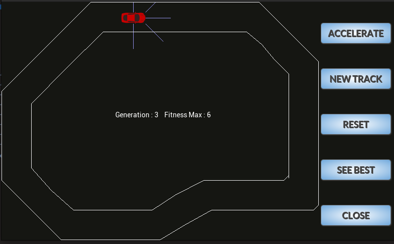
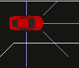

# Self-driving-Car

* [How to Build](#how-to-build)
* [General Info](#general-info)
* [Demonstration](#demonstration)

## How to Build

To build this project you must have installed SDL2.xx, SDL2-ttf.xx and SDL2-gtx.xx librairies. So make sure you have installed them before continuing. 

So to build the project a Makefile is provided, you can build and execute the project as follow : 

```
$ make
$ ./bin
```

If you want to clean the files created (.o & .d) just do a make clean.

## General Info

This project was a Summer project from 2022 write only in C. I wanted to learn more about genetic algorithm and their application so i had this idea from a group of student of my school that decided to do this project as their final project. I decided to do everything from the beginning dealing with the graphic part and the more mathematic part.



### How does it work ?

So to make the car "learn" how to drive i used different population of car that i made drive along a circuit. The one with the highest score is the one who will be reproduce for the next generation after a Crossover and Mutation. Reproducing and selecting the car after x generation lead generaly to a car able to race on mutliple tracks. 



Each car have 5 sensors giving the distance information from each wall. The neural network take into input the distance and the speed and output the action to do : accelerate, brake, turn left/right or nothing.

### Features

* **Accelerator** decrease the number of delay between to frame and make the process quicker, you must use it if you want to see the car succesfully driving in a minimal period of time.

* **New Track** change the track to make sure the car is well trained on all track and not only on one. Other tracks will be add in the futur. 

* **Reset** sometimes the car are not evolving enough and it's sometimes better to reset and restart with a fresh new generation.

* **See Best** to see only the best car overall the car from all the different generation. 

* **Close**

## Demonstration

[perfect.webm](https://github.com/Pauldht/Self-driving-Car/assets/72760035/70edadec-03fe-437c-9a06-e837a6ca1d5d)
